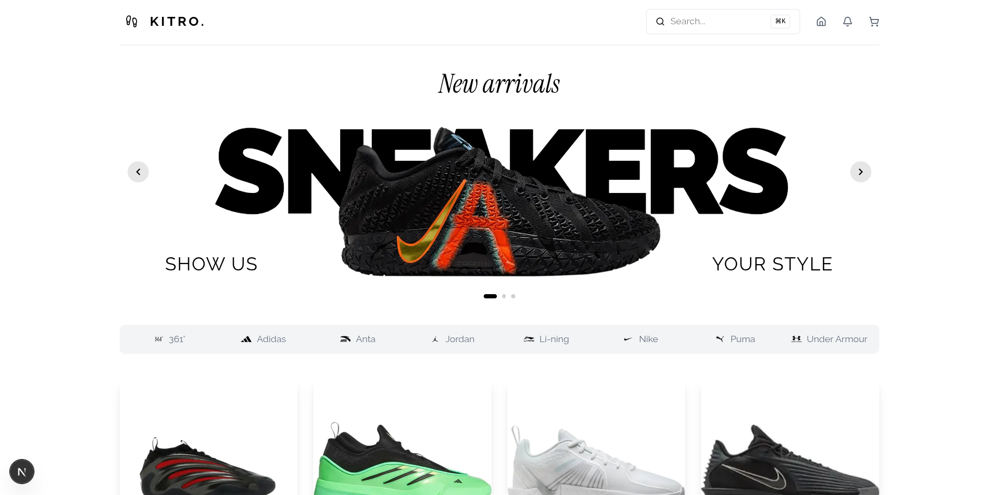
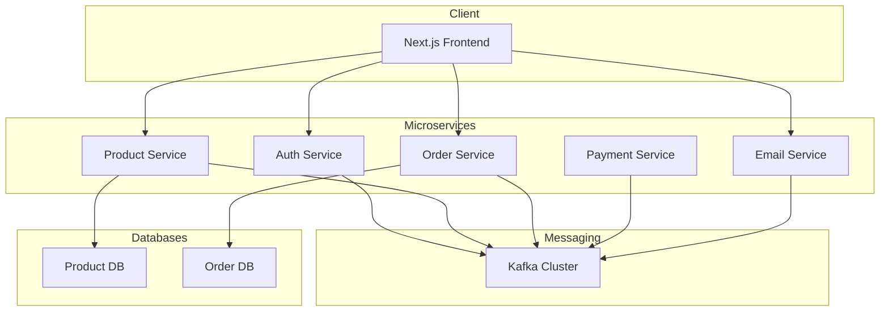

# 🛒 Microservices Architecture Playground | Educational E-Commerce Application


A hands-on educational project for learning microservices architecture, event-driven design, and modern full-stack development. This platform demonstrates best practices for building scalable, maintainable, production-ready applications covering user authentication, product browsing, cart management, order processing, and payment handling.

## Preview



## Table of Contents

- [🛒 Microservices Architecture Playground | Educational E-Commerce Application](#-microservices-architecture-playground--educational-e-commerce-application)
  - [Preview](#preview)
  - [Table of Contents](#table-of-contents)
  - [Architecture](#architecture)
  - [Project Structure](#project-structure)
  - [Getting Started](#getting-started)
  - [Environment Variables](#environment-variables)
    - [Client App](#client-app)
    - [Auth Service](#auth-service)
    - [Product Service](#product-service)
    - [Order Service](#order-service)
    - [Payment Service](#payment-service)
    - [Email Service](#email-service)
  - [API Reference](#api-reference)
    - [Authentication](#authentication)
    - [Products](#products)
    - [Orders](#orders)
    - [Payments](#payments)
    - [Kafka Topics](#kafka-topics)
  - [Development](#development)
  - [Notes \& Tips](#notes--tips)
  - [License](#license)

## Architecture



**Key patterns:**

- **Microservices** — independent services scoped to business domains
- **Event-Driven** — asynchronous communication via Kafka
- **API Gateway** — Next.js serves as both frontend and API gateway
- **Database Per Service** — isolated data ownership per domain

## Project Structure

```
microservices-ecommerce/
├── apps/
│   ├── client/             # Next.js frontend
│   ├── admin/              # Admin dashboard
│   ├── auth-service/       # Authentication (port 3003)
│   ├── product-service/    # Product management (port 3004)
│   ├── order-service/      # Order processing (port 3005)
│   ├── payment-service/    # Payment handling (port 3006)
│   └── email-service/      # Email notifications (port 3007)
├── packages/
│   ├── kafka/              # Shared Kafka utilities
│   ├── eslint-config/      # Shared ESLint config
│   ├── typescript-config/  # Shared TypeScript config
│   └── types/              # Shared TypeScript types
└── turbo.json
```

| Service         | Responsibility         | Port |
| --------------- | ---------------------- | ---- |
| Client          | Frontend & API gateway | 3002 |
| Auth Service    | Authentication         | 3003 |
| Product Service | Product management     | 3004 |
| Order Service   | Order processing       | 3005 |
| Payment Service | Payment handling       | 3006 |
| Email Service   | Email notifications    | 3007 |

**Service summaries:**

- **Client** (`apps/client`) — Next.js app handling UI, API calls, Clerk auth, and Zustand state
- **Admin** (`apps/admin`) — Dashboard for managing products, orders, and users
- **Auth Service** — REST APIs for authentication, delegates identity to Clerk
- **Product Service** — Product catalog CRUD, emits Kafka events on changes
- **Order Service** — Order lifecycle management, integrates with payment service
- **Payment Service** — Stripe payment processing, webhook handling, and refunds
- **Email Service** — Transactional emails for order confirmations and notifications via Nodemailer

## Getting Started

**Prerequisites:** Node.js 18+, pnpm 9+, Docker (optional, for Kafka), Git

1. **Clone the repository**

   ```bash
   git clone https://github.com/HarenaFiantso/microservices-arch-playground.git
   cd microservices-arch-playground
   ```

2. **Install dependencies**

   ```bash
   pnpm install
   ```

3. **Start Kafka**

   ```bash
   cd packages/kafka
   docker-compose up -d
   ```

4. **Configure environment variables** — see [Environment Variables](#environment-variables)

5. **Run the application**

   ```bash
   # All services
   pnpm dev

   # Individual service
   pnpm dev --filter=client
   pnpm dev --filter=auth-service
   ```

> [!IMPORTANT]
> Never commit `.env` files. Always use environment variables for secrets and sensitive configuration.

## Environment Variables

#### Client App

```env
NEXT_PUBLIC_CLERK_PUBLISHABLE_KEY=your_clerk_publishable_key
NEXT_PUBLIC_APP_URL=http://localhost:3002
```

#### Auth Service

```env
CLERK_SECRET_KEY=your_clerk_secret_key
CLERK_PUBLISHABLE_KEY=your_clerk_publishable_key
DATABASE_URL=your_database_url
KAFKA_BROKERS=localhost:9092
KAFKA_CLIENT_ID=auth-service
PORT=3003
```

#### Product Service

```env
DATABASE_URL=your_database_url
KAFKA_BROKERS=localhost:9092
KAFKA_CLIENT_ID=product-service
PORT=3004
```

#### Order Service

```env
DATABASE_URL=your_database_url
KAFKA_BROKERS=localhost:9092
KAFKA_CLIENT_ID=order-service
PORT=3005
STRIPE_SECRET_KEY=your_stripe_secret_key
```

#### Payment Service

```env
KAFKA_BROKERS=localhost:9092
KAFKA_CLIENT_ID=payment-service
PORT=3006
STRIPE_SECRET_KEY=your_stripe_secret_key
STRIPE_WEBHOOK_SECRET=your_webhook_secret
```

#### Email Service

```env
KAFKA_BROKERS=localhost:9092
KAFKA_CLIENT_ID=email-service
PORT=3007
SMTP_HOST=your_smtp_host
SMTP_PORT=587
SMTP_USER=your_smtp_user
SMTP_PASS=your_smtp_password
```

## API Reference

#### Authentication

```typescript
POST / api / auth / register; // { email, password, name }
POST / api / auth / login; // { email, password }
GET / api / auth / me; // Returns current user profile
```

#### Products

```typescript
GET  /api/products         // List all products (paginated)
GET  /api/products/:id     // Get product by ID
POST /api/products         // Create product (admin only)
```

#### Orders

```typescript
POST /api/orders              // { items: OrderItem[], shippingAddress }
GET  /api/orders/:id          // Get order details
GET  /api/orders/user/:userId // Get user's orders
```

#### Payments

```typescript
POST / api / payments / create - payment - intent; // { amount, currency }
POST / api / payments / webhook; // Stripe webhook for payment updates
```

#### Kafka Topics

```typescript
const TOPICS = {
  USER_CREATED: 'user.created',
  PRODUCT_UPDATED: 'product.updated',
  ORDER_PLACED: 'order.placed',
  PAYMENT_COMPLETED: 'payment.completed',
  EMAIL_SENT: 'email.sent',
};
```

Services communicate either synchronously via REST (immediate responses) or asynchronously via Kafka (decoupled events).

## Development

```bash
pnpm dev          # Start all services
pnpm build        # Build all services
pnpm lint         # Lint all code
pnpm format       # Format code
pnpm check-types  # Type check
```

All services support hot reloading. Run `pnpm dev` inside any `apps/*` directory to start a service independently.

> [!NOTE]
> The monorepo uses pnpm workspaces for package management and Turbo for task orchestration and caching. Shared configuration lives in `packages/`.

## Notes & Tips

> [!IMPORTANT]
>
> - Validate all user inputs to prevent injection attacks
> - Always use HTTPS in production; implement CORS restrictions
> - Use rate limiting to protect against abuse
> - Keep dependencies updated

> [!IMPORTANT]
>
> - Create topics with appropriate partition counts
> - Set retention policies per topic
> - Enable SSL/TLS for broker connections
> - Monitor consumer lag and throughput

> [!NOTE]
>
> **Why Kafka?** Event-driven architecture enables loose coupling, scalable message processing, and support for event sourcing patterns.
>
> **Why Microservices?** Independent deployability, fault isolation, and team autonomy at the cost of operational complexity.
>
> **Why Next.js?** Server-side rendering for SEO, built-in API routes, and fast refresh during development.

> [!TIP]
>
> - Start with the auth service and build incrementally
> - Use mock data before wiring up real services
> - Add database indexes for frequently queried fields
> - Commit often with descriptive messages

> [!TIP]
>
> - Batch database queries (chunk large ID arrays into groups of 100)
> - Cache frequently accessed data to reduce DB load
> - Use lazy loading and code splitting on the frontend
> - Optimize images with modern formats and compression

> [!TIP]
>
> - Add a test suite
> - Set up Redis caching
> - Configure CI/CD
> - Expand API documentation with request/response examples

## License

This project is for educational purposes only. Ensure you have the necessary permissions before using any part of it in production.
